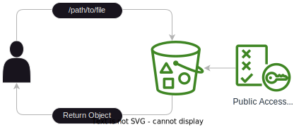

<!-- markdownlint-disable MD013 MD033-->

# Serving compressed files from AWS S3

**TLDR**:  
This repo contains the code to serve pre-compressed files from an S3 bucket using  
CloudFront distribution and CloudFront functions.  

Skip to [Deployment](#deployment) if you just wanna run it

## GOALS

- Serve the best encoding based on browser support 💡
- Fall back to uncompressed files if compression is not supported ↩️
- Utilize the CloudFront edge locations to reduce latency ⚡☁️
- Cache the responses to reduce latency and cost ⚡

## Background

I have an obsession with minimizing file sizes, and by the looks of it,  
I am not alone. When searching for the best way to serve compressed files from  
S3 bucket I came across a handful of articles, blog posts, and StackOverflow answers.  
Generally they break down into 2 categories:  

- Only upload compressed files to S3
- Using CloudFront built-in compression

Neither of these approaches seemed ideal to me.

## Methods

### Only upload compressed files to S3

Just removing the gz or br extension from compressed files and uploading them to S3  
seems like the easiest approach but there is a caveat. The user will not be able to  
access the uncompressed files if their browser does not support the compression encoding.  
It also forces you to choose between using gzip for better support or brotli for better compression.  

### Using CloudFront built-in compression

AWS CloudFront supports native compression for certain file types[^file_types].  

With a few caveats:  

- It does not guarantee that the compression will be applied and at what level
- If it caches an uncompressed response it will continue to serve it to the user until it expires
- Files under 10MB only  
- And some other limitations[^cf_comp_docs]

### Using CloudFront Functions

We can serve the best format based on browser support.

### Comparison Table

| Method | File type support | Max Compression| Accessibility
| --- | --- | --- | --- |
| built-in Compression| [^file_types] | ❌ | ✅ |
| CloudFront Functions | any | ✅ | ✅ |
| Compression Swap | any | ✅ | ❌ |

## Uploading files

When using aws S3 put objects the wrong content type will be set for the
compressed files, since their extension is not the same as the original file.  
We set both **content_type** and **content-encoding** when uploading the files to S3.

## Access Policy

Next we need to be able to access the objects in the bucket we could set the bucket
policy to only give access to the cf distribution but for now we can simply give public access

## Redirect requests

CF Function will look at  the **Accept-Encoding** field in the viewer-request headers
and will modify the viewer-request URL accordingly.

## Caching

In order to reduce GET requests to S3 bucket, and lower latency we need to cache the responses.

First you must disable **Accept-Encoding** for brotli and gzip compression this is  
because AWS will automatically try to compress the data on the fly when it sees fit.  
Next we need to allow **Accept-Encoding** in headers, and set it as our cache key.  
This will allow us to cache the request based on the **Accept-Encoding** header

## Testing

**curl**:  

1. Send a request with the **Accept-Encoding** header set to "gzip, br".  
Check the response headers to see if the content-encoding is set to br.

```bash
curl -s -I -H "Accept-Encoding: br" "${URL_TO_CHECK}" | grep -i "content-encoding"
```

Or run the test script

```bash
$ bash test.sh
[✔] gzip support.
[✔] Brotli support.
[✔] brotli prefered.
```

**browser**:  

1. open the developer tools [F12] and go to the network tab
2. then refresh the page
3. the response headers should have the content-encoding set to gzip

## Deployment

Requirements:  

- [Pulumi](https://www.pulumi.com/docs/get-started/install/)

Directions:  

- Put your files in www folder
- compress them if you haven't already
- run pulumi

```bash
bash compress.sh
pulumi up
```

## TODO

No Planned: 🚫 | Not started: 🏁 | Work in progress: 🚧 | Completed: 🎉

- [🚧] Specify file types to serve compressed files for
- [🏁] Limit S3 access to CloudFront distribution [^s3_policy]
- [🏁] Run benchmarks to compare the different methods[^benchmark_ref]
- [🚧] Include Architecture diagrams
- [🚫] Implement Same Architecture using R2 and Cloudflare Workers
- [🚧] Analyse in what circumstances this has a significant impact on cost

### Progression

1. user just accesses the files in S3 bucket
    - create S3 bucket
    - upload files to S3 bucket
    - set the bucket policy to public access
    - set index.html as the default page  
    

2. user accesses the files in S3 bucket through CloudFront
    - create CloudFront distribution
    - associate the S3 bucket with the CloudFront distribution
    - set the default cache policy to cache everything

3. user accesses the files in S3 bucket through CloudFront with CloudFront functions to get the compressed files
    - compress the files
    - set the content_type of the files when uploading to S3
    - create CloudFront function to redirect user request to the compressed files
    - associate the CloudFront function with the CloudFront distribution

4. user accesses the files in S3 bucket through CloudFront with CloudFront functions and caching
    - create cache policy
    - forward Accept-Encoding header to origin
    - disable Accept-Encoding header for brotli and gzip compression

[^file_types]: https://docs.aws.amazon.com/AmazonCloudFront/latest/DeveloperGuide/ServingCompressedFiles.html#compressed-content-CloudFront-file-types  
[^cf_comp_docs]: https://docs.aws.amazon.com/AmazonCloudFront/latest/DeveloperGuide/ServingCompressedFiles.html
[^s3_policy]: https://docs.aws.amazon.com/AmazonCloudFront/latest/DeveloperGuide/private-content-restricting-access-to-s3.html#oac-permission-to-access-s3
[^benchmark_ref]: https://blog.cloudflare.com/results-experimenting-brotli/
